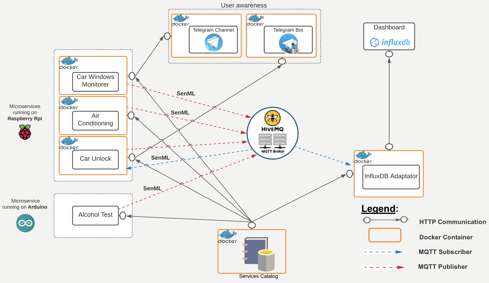
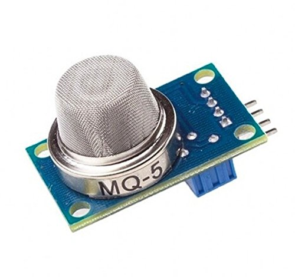
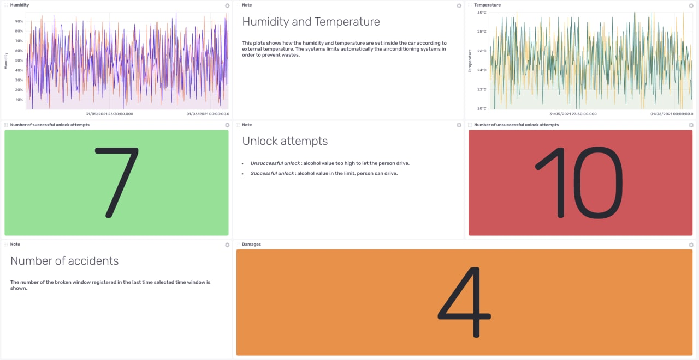
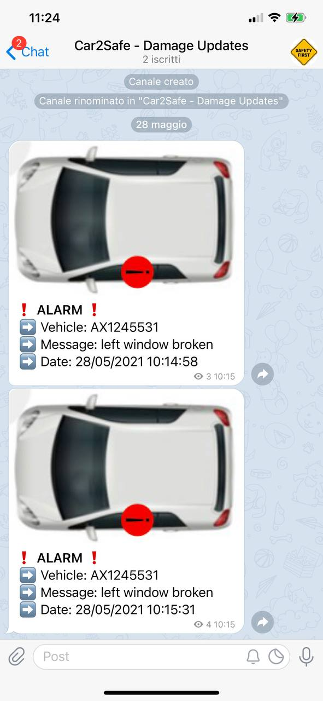
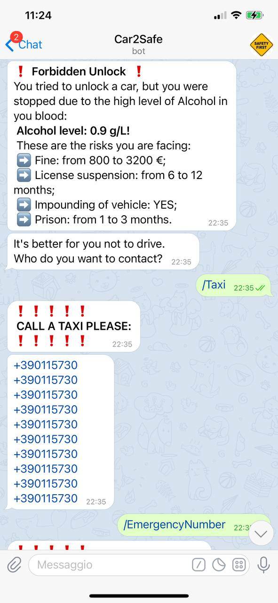

 # Car2Smart - Safe Car Sharing
Programming for IoT - ICT4SS @politecnicoditorino - 2020/2021
Developed by [Jacopo Braccio](https://github.com/jacopobr), [Francesco Conforte](https://github.com/FrancescoConforte), [Sara De Luca](https://github.com/delucasara), [Matteo Mastrota](https://github.com/MatteoMastrota).

  - [Introduction](#introduction)
  - [General platfrom architecture](#general-platfrom-architecture)
  - [Microservices](#microservices)
    - [Expose Catalog](#expose-catalog)
    - [Alcohol Test](#alcohol-test)
    - [Car Unlock](#car-unlock)
    - [Air Conditioning](#air-conditioning)
    - [Windows Monitorer](#windows-monitorer)
    - [Dashboard Adaptator](#dashboard-adaptator)
    - [Telegram Bot](#telegram-bot)
  - [Demo video](#demo-video)

## Introduction
Car2Smart is an IoT microservice oriented platform which aims at improving car sharing services, with a particular eye on safety.
One of the major reason of car accidents is alcohol. Preventing a person from driving in an alterated state is crucial for road safety and could eventually save lives. 
With Car2Smart, before car's rent starts, the user must take an alcohol test in order to be able to unlock the car. If the alcohol test is negative, the booking can start, otherwise the user is not allowed to drive and will be prompted to find an alternative.
Furthermore, Car2Smart offers a fast way of noticing accidents and vandalism against car fleet and a control system for air conditioning in order to reduce wastes. 

## General platfrom architecture

The general platfrom architecture is reported in the following image:

    

The following components can be distinguished:
* Arduino: used to take the alcohol test;
* Raspberry: emulates the car control unit;
* Telegram: allows fast communication both with the users and the car sharing company;
* Dashboard: used for decision making by the car sharing company;
* MQTT broker: responsible for receiving all MQTT messages, filtering the messages, determining who is subscribed to each message, and sending the message to these subscribed clients, [HiveMQ](https://www.hivemq.com) was the choice.
  
For each components, one or more microservices are implemented. Each microservice is dockerized to deploy and replicate the system more quickly and easily.

## Microservices 
### Expose Catalog
The catalog is the core entity of the platform. It contains information about alcohol thresholds, air conditioning settings, car fleet (sensors and status of the car) as well as information on how to connect to the MQTT broker and the telegram bot.
The catalogue is exposed using HTTP REST apis, following a RESTful paradigm. It is reached by the other microservices to get the information needed.
### Alcohol Test
Running on Arduino, this service is used by the user to take the alcohol test before unlocking the car. Through a [MQ-5](https://www.mouser.com/datasheet/2/744/Seeed_101020056-1217478.pdf) Gas sensor, the breath alcohol level is collected and it's published on the MQTT broker using the topic `smart2safe/arduino/<car_plate>/alcohol_test` in the [SenML](https://tools.ietf.org/id/draft-ietf-core-senml-12.html) format.

     <i>MQ-5 gas sensor</i>

### Car Unlock
Running on Raspberry. It catches the messages contating the alcohol values from the MQTT broker, checks the thresholds in order to unlock the car or not. If the alcohol test is positive, it communicated with the Telegram bot via HTTP, where it posts a message containg information for the user such as: measured alcohol level, foreseen fine (multa), car impounding (sequestro del mezzo), licence suspension and foreseen months of prisons according to the Italian Law.
Furthermore, it publishes on MQTT broker a message useful to generate statistics on the dashboard using the topic using the topic `smart2safe/raspberry/<car_plate>/alcohol_test`.
 
### Air Conditioning
Running on Raspberry. Through the user of a [DHT11](https://www.mouser.com/datasheet/2/758/DHT11-Technical-Data-Sheet-Translated-Version-1143054.pdf) sensor, the temperature and the humidity inside the car are collected and published on the MQTT broker in the SenML format using the topic `smart2safe/raspberry/<car_plate>/aircondition`. According to the values collected and the threshold defined in the catalog, the air conditioning may be turned off.

     <i>DHT11 temperature and humidity sensor</i>

### Windows Monitorer
Running on Raspberry. Using a microphone, it listens to the surrounding and performs audio processing to detect if a glass breaks. In case of break, it sends a HTTP post message to the telegram bot that will eventually notify the car sharing company and publish the event on the MQTT broker using the topic `smart2safe/raspberry/<car_plate>/window_monitor`.

### Dashboard Adaptator
It is used to visualize all the data collected in a nicer way thanks to the [InfluxDB Cloud](https://www.influxdata.com/products/influxdb-cloud/) dashboard tool. 

     <i>Dashboard view preview</i>

### Telegram Bot
Telegram represent the user awarness side of the platform. A bot recheable at @Car2Safe is created. The bot can perform two main tasks:
* Publish on the 'Car2Safe - Damages Updates' channel whenever it receives a HTTP post request from the 'Window Monitorer' service. The message will contain information about the received damage.
* Contact the user in case of positive alcohol test and prompt him to call its emergency number of the taxi company instead.
  

    <i></i>
     <i>Telegram Channel - Telegram Bot</i>

## Demo video
Here is a quick video on how the plaftorm actually works:

